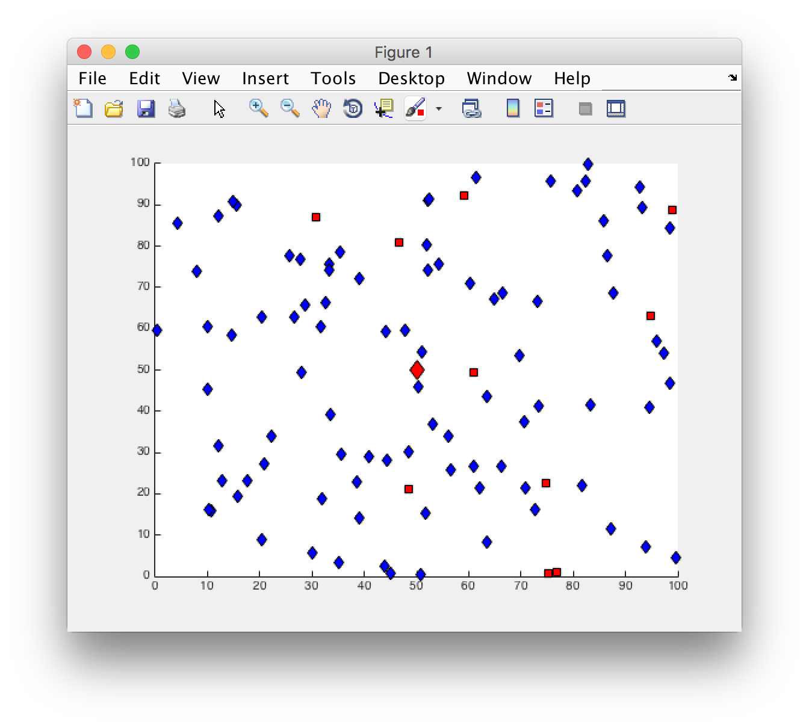

# Energy efficient wireless sensor network routing protocol with hierarchical clustering based on the genetic algorithm.

## TODO

* Direct search of possible genotypes with a small number of nodes
* Update fitness function
* Tests
